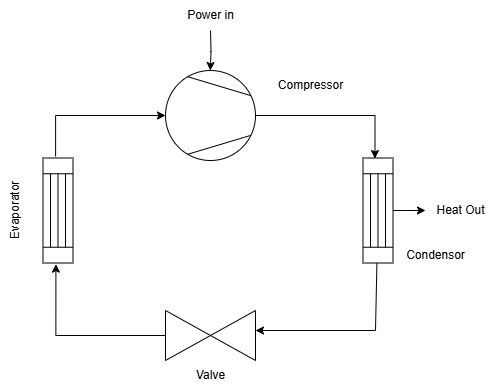

# Cycle Modeling

## Carnot Cycle

## Vapour Compression Cycle

 

We first start by loading the adequate packages and the fluid:
```julia
using CarnotCycles, CoolProp, ModelingToolkit, DifferentialEquations
@independent_variables t
load_fluid("R134A")
```


Then we define the source thermodynamic state -  the starting point of the cycle.
```julia
ΔT_sh = 5
p_ = 101325*5; T_ = PropsSI("T","Q",1,"P",p_,"R134A") + ΔT_sh
h_ = PropsSI("H","T",T_,"P",p_,"R134A")
```

The we choose the adequate components for the vapour compression cycle:
```julia
@named source = MassSource()
@named compressor = CarnotCycles.IsentropicCompressor()
@named condensor = CarnotCycles.SimpleCondensor()
@named valve = Valve()
@named evaporator = SimpleEvaporator()
@named sink = MassSink()
```

Then we connect them in necessary order:

```julia
systems = [source, compressor,condensor,valve,evaporator,sink]
eqs = [
        connect(source.port,compressor.inport)
        connect(compressor.outport,condensor.inport)
        connect(condensor.outport,valve.inport)
        connect(valve.outport,evaporator.inport)
        connect(evaporator.outport,sink.port)
]

@named VCC = ODESystem(eqs,t,systems = systems)
sys = structural_simplify(VCC)
```

Then we choose the parameters of the system:

```julia
para = [
    source.source_pressure => p_, source.source_enthalpy => h_, source.source_mdot => 0.02, 
    compressor.πc => 3, compressor.η => 0.7,
    condensor.ΔT_sc => 3,
    valve.πc => compressor.πc,
    evaporator.ΔT_sh => ΔT_sh, 
]
```

Then we proceed to solve the problem:

```julia
u0 = []
prob = SteadyStateProblem(sys,u0,para)
sol = solve(prob)
```

To get the Coeffecient of Performace of the cycle: 
```julia
julia> COP = sol[condensor.Qdot]/sol[compressor.P]
-5.096928812859646
```

---
**NOTE**

Energy given to the fluid is +ve while given by the fluid is -ve. Hence the COP is negative

---


### Plotting the Cycle


To model a cycle with Claperyon.jl only change the fluid
Example: 
```julia
using CarnotCycles, ModelingToolkit, DifferentialEquations, Clapeyron
@independent_variables t
model = cPR(["Pentane","toluene"],idealmodel = ReidIdeal)
load_fluid(model)
```

