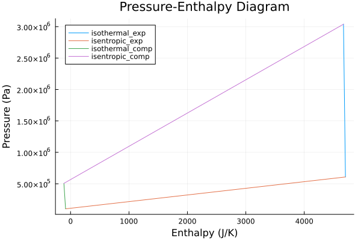
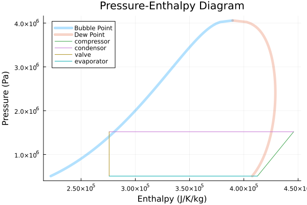

# Cycle Modeling

## Loading Fluids
Two type of fluid model backends are supported - Clapeyron.jl and CoolProp.jl.

To load a [Clapyeron.jl](https://github.com/ClapeyronThermo/Clapeyron.jl) backend fluid model do the following: 
```julia
using CarnotCycles, Clapeyron
fluid = cPR(["isopentane","isobutane"],idealmodel = ReidIdeal)
load_fluid(fluid)
```
As of now we support Clapeyon mixtures of up to 2 components.

For [CoolProp.jl](https://github.com/CoolProp/CoolProp.jl) backend fluid properties simply pass the fluid name as a string as follows:
```julia
using CarnotCycles, CoolProp
load_fluid("R601")
```
---
**NOTE**

Once the fluid model is chosen through the simulation the underlying components are chosen based on the fluid model.

---

## Carnot Cycle
As the name of this package is CarnotCycles.jl, we would first like to model a simple Carnot Cycle using CoolProp.jl even though it is not really physically possible to have one. 


His cycle follows a isothermal exapansion of the gas, isentropic expansion, isothermal compression , and finally isentropic compression.

So we will use Clapeyron.jl for our gas model. Here we choose the gas to be Argon.

```julia
using CarnotCycles, ModelingToolkit, Clapeyron, SteadyStateDiffEq

fluid = cPR(["Argon"],idealmodel = ReidIdeal)
load_fluid(fluid)
@independent_variables t
```

The we choose our processes as components and connect them. A `source` and `sink` is recommended to initiate and close the cycle.
```julia
@named source = MassSource()
@named isothermal_comp =  IsothermalCompressor()
@named isentropic_comp = IsentropicCompressor()
@named isothermal_exp = IsothermalExpander()
@named isentropic_exp = IsentropicExpander()
@named sink = MassSink()

eqs = [
    connect(source.port,isothermal_exp.inport)
    connect(isothermal_exp.outport,isentropic_exp.inport)
    connect(isentropic_exp.outport,isothermal_comp.inport)
    connect(isothermal_comp.outport,isentropic_comp.inport)
    connect(isentropic_comp.outport,sink.port)
]

systems = [source,isothermal_exp,isentropic_exp,isothermal_comp,isentropic_comp,sink]

@named CarnotCycle = ODESystem(eqs, t, systems=systems)
@time sys = structural_simplify(CarnotCycle)
```

Now we state the point at `source`
```julia
πc_1 = 5; πc_2 = 6
source_mdot = 30 #g/s
z_source = CarnotCycles.mass_to_moles(fluid,1,source_mdot)
source_temp = 600; source_pressure = 101325*30; 

para = [
    source.source_temperature => source_temp, source.source_mdot => source_mdot, source.source_x => 1, source.source_pressure => source_pressure,
    isothermal_exp.πc => πc_1,
    isentropic_exp.πc => πc_2, isentropic_exp.η => 1,
    isothermal_comp.πc => πc_1,
    isentropic_comp.πc => πc_2, isentropic_comp.η=>1
]
u0 = []
prob = SteadyStateProblem(sys,u0,para)
sol = solve(prob)
```

To plot the diagram just pass the `systems` and `sol` with the adjecent names of the components as a string. Pass the `systems` and the name string in the same order. The name string should be without `source` and `sink`. 
```julia
system_string = ["isothermal_exp","isentropic_exp","isothermal_comp","isentropic_comp"]
plot(sol,systems,system_string,type = :PH,phase = false)
```


## Vapour Compression Cycle
Now we move to modeling a simple Vapour Compression Cycle.  

 

We first start by loading the adequate packages and the fluid:
```julia
using CarnotCycles, CoolProp, ModelingToolkit, SteadyStateDiffEq
@independent_variables t
load_fluid("R134A")
```


Then we define the source thermodynamic state -  the starting point of the cycle.
```julia
ΔT_sh = 5
p_ = 101325*5; T_ = PropsSI("T","Q",1,"P",p_,"R134A") + ΔT_sh
```

The we choose the adequate components for the vapour compression cycle:
```julia
@named source = MassSource()
@named compressor = CarnotCycles.IsentropicCompressor()
@named condensor = CarnotCycles.SimpleCondensor()
@named valve = Valve()
@named evaporator = SimpleEvaporator()
@named sink = MassSink()
```

Then we connect them in necessary order:

```julia
systems = [source, compressor,condensor,valve,evaporator,sink]
eqs = [
        connect(source.port,compressor.inport)
        connect(compressor.outport,condensor.inport)
        connect(condensor.outport,valve.inport)
        connect(valve.outport,evaporator.inport)
        connect(evaporator.outport,sink.port)
]

@named VCC = ODESystem(eqs,t,systems = systems)
sys = structural_simplify(VCC)
```

Then we choose the parameters of the system:

```julia
para = [
    source.source_pressure => p_, source.source_temperature => T_, source.source_mdot => 0.02, 
    compressor.πc => 3, compressor.η => 0.7,
    condensor.ΔT_sc => 3,
    valve.πc => compressor.πc,
    evaporator.ΔT_sh => ΔT_sh, 
]
```

Then we proceed to solve the problem:

```julia
u0 = []
prob = SteadyStateProblem(sys,u0,para)
sol = solve(prob)
```

To get the Coeffecient of Performace of the cycle: 
```julia
julia> COP = sol[condensor.Qdot]/sol[compressor.P]
-5.096928812859646
```

For plotting the phase diagram
```julia
system_string = ["compressor","condensor","valve","evaporator"]
CarnotCycles.plot(sol,systems,system_string,type = :PH,phase = true)
```


---
**NOTE**

Energy given to the fluid is +ve while given by the fluid is -ve. Hence the COP is negative

---


### Solution Viewing
There are generally two ways: 
    1. Printing the output on the terminal using `show_all_states(sol,systems,system_string)`
    2. Plotting the necessary diagram


