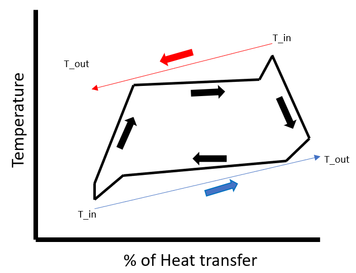

# Cycle Optimization

So we have seen before on how to model basic cycles. But now we would like to know what would be the most optimum parameters to model a cycle to say maximize the efficiency.


So we have seen before on how to model basic cycles. But now we would like to know what would be the most optimum parameters to model a cycle.

The cycles created can be wrapped with functions and sent to optimization routines. Most of the optimal solutions of purely theromodynamic systems lie at the boundary of constrains or saturation curve. Hence the initial box of constrain chosen has to be robust enough to have decent volume of feasible solutions.

The most trusted algorithms for thermodynamic optimizations are Genetic Algorithms. It is well integrated with
[Optimization.jl](https://docs.sciml.ai/Optimization/stable/) and [Metaheuristics.jl](https://github.com/jmejia8/Metaheuristics.jl)


## Example

Here we take the case of an Organic Rankine cycle, we would like to know what are the most optimal parameters to get the most efficient cycle. 

 

A simple ORC contains a pump, evaporator, expander and condensor.

Here we use the condensor and evaporators such that the inlet and outlet temperature of the heat transfer fluids are known. In heat exchanger terms we fix the heat transfer fluid glide for the evaporator and the condensor. 

This puts an additional constraint on the heat exchanges, i.e. the temperature profile of the heat transfer fluid and the working fluid should not cross each other. In other words we want to know what would be the most efficient ORC that fits two temperature profile bounds.




So we first describe our cycle:
```julia
using CarnotCycles, ModelingToolkit, Clapeyron, SteadyStateDiffEq
fluid = cPR(["isopentane","isobutane"],idealmodel = ReidIdeal)
load_fluid(fluid)
@independent_variables t
```

Choose the ORC components
```julia
@named source = MassSource()
@named pump = Pump()
@named evaporator = SimpleEvaporatorGlide(N = 10)  # N is the number of interal discretization points
@named turbine = IsentropicExpander()
@named condensor = SimpleCondensorGlide(N = 10)
@named sink = MassSink()

systems = [source,pump,evaporator,turbine,condensor,sink]

eqs = [
    connect(source.port,pump.inport)
    connect(pump.outport,evaporator.inport)
    connect(evaporator.outport,turbine.inport)
    connect(turbine.outport,condensor.inport)
    connect(condensor.outport,sink.port)
]

@named system = System(eqs,t,systems = systems)
@time sys = mtkcompile(system)
```

Now we have define our cycle we can make a function to pass to the optimizer.


We would like to know the optimal pressure at source, mass fraction, pressure ratio, super heat temperature and sub cool temperature, for given set of parameters.

```julia
function ORC(x,p)
try
    T_htf_cond = p[4];
    T_htf_evap = p[3];
    @assert T_htf_evap[1] > T_htf_evap[2]
    @assert T_htf_cond[1] < T_htf_cond[2]
    z_source = CarnotCycles.mass_to_moles(fluid,x[2],p[5])
    T_source = CarnotCycles.Bubble_temperature(fluid,x[1],z_source) - x[5]
    # h_source = CarnotCycles.pt_enthalpy(fluid,x[1],T_source,z_source)
    u0 = []
    para = [source.source_pressure => x[1], source.source_temperature => T_source, source.source_mdot => p[5], source.source_x => x[2],
        pump.πc => x[3], pump.η => p[2],
        evaporator.ΔT_sh => x[4], evaporator.T_htf_in => T_htf_evap[1], evaporator.T_htf_out => T_htf_evap[2],
        turbine.η => p[1], turbine.πc => pump.πc,
        condensor.T_htf_in => T_htf_cond[1], condensor.T_htf_out => T_htf_cond[2], condensor.ΔT_sc => x[5]
        ]

    prob = SteadyStateProblem(sys,u0,para)
    sol =solve(prob)
    
    # Check inlet of pump to be liquid
    try
        sol[pump.LiquidPhase]
    catch
        return 1e4
    end

    # Check if the temperature profiles in the evaporator and condenser are feasible

    if sol[evaporator.is_feas] == false
        return 1e4
    end

    if sol[condensor.is_feas] == false
        return 1e4
    end
    return @show (sol[turbine.P] + sol[pump.P])/sol[evaporator.Qdot]
catch
    return 1e4
end
end
```

---
**NOTE**

There needs to be exceptional handling for optimzation as sometimes the internal function evaluations of Clapeyron.jl or CoolProp.jl can throw errors, the exception handeling allows us to surpass it. For the cases with an exception we return a penalty value. 

---

Solving the optimization problem:
```julia
x0 = [101325*5,0.5,3,3,3]
para = [0.7,0.7,(390,380),(290,300),20]
lb = [101325,0.01,2,2,2]
ub = [101325*5,0.99,15,10,10]

using Optimization, OptimizationMetaheuristics

fopt = OptimizationFunction(ORC)
prob_opt = OptimizationProblem(fopt,x0,para,lb=lb,ub=ub)
sol = solve(prob_opt, PSO(N = 100), maxiters = 100000, maxtime = 300.0)
```