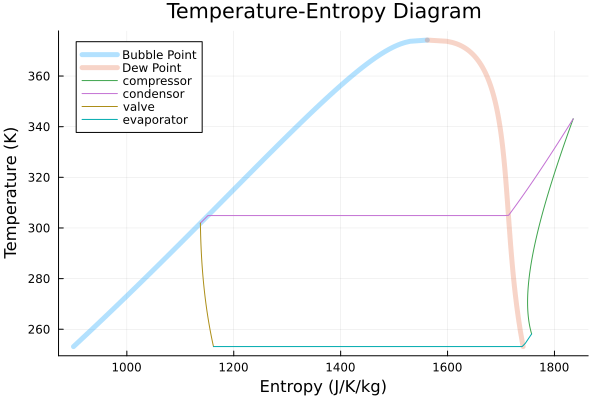
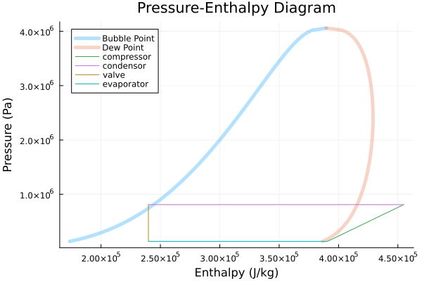

# CarnotCycles.jl

Documentation of CarnotCycles.jl.

The goal of this package is to have a basic acausal framework to model various thermodynamic cycles. 

This package combines [ModelingToolkit.jl](https://github.com/SciML/ModelingToolkit.jl) with [CoolProp.jl](https://github.com/CoolProp/CoolProp.jl) and [Clapyeron.jl](https://github.com/ClapeyronThermo/Clapeyron.jl). 

The themodynamic components are modelled as steady state components.

As of now the components are modelled using the first and second law of thermodynamics.

